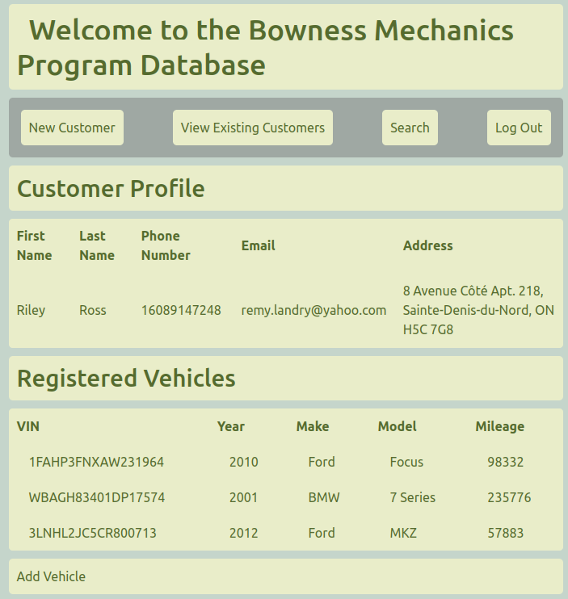
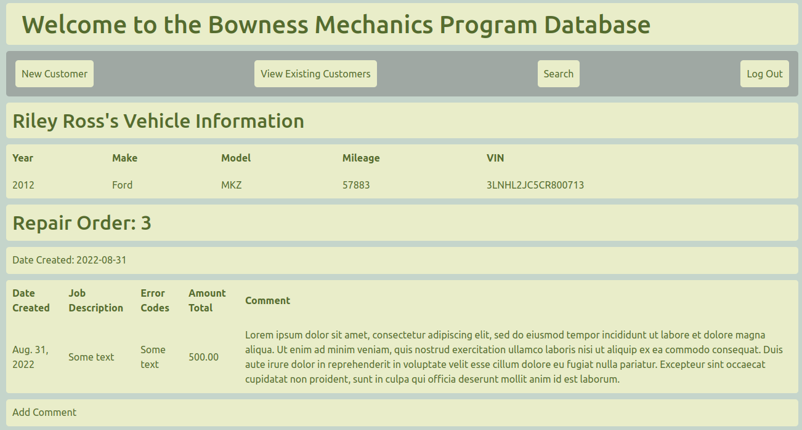

# bhs_app
A basic automotive web application to manage customer, vehicle and repair order information
for a repair shop that was still using pen-and-paper hard copies for record keeping.

It's built around a Python-Django web framework and an SQLite database.

Future development can add more detailed information for diagnostic codes, billing calculations, etc.
This will allow for better data processing, basic stats and identifying trends.

## Screentshot

## Running
To run, activate your virtual environment from the project root `source venv/bin/activate`. From `./bhs/bhs_app/` run `python manage.py runserver` and open the link to `http://127.0.0.1:8000`. Enjoy!
